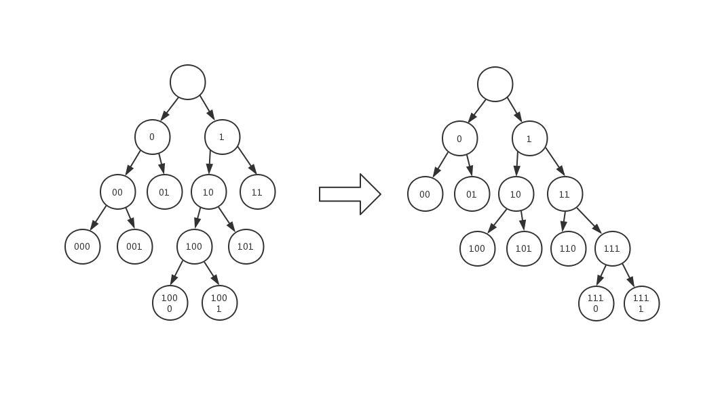

# 跟我寫 JPEG 解碼器（三）讀取量化表、霍夫曼表

## 本章目標

在[上一章](./跟我寫jpeg解碼器（二）檔案結構.md)提到，要解碼 baseline JPEG ，僅需要認識 6 個標頭，扣除掉不含數據的檔頭、檔尾標記，我們僅需要讀取 4 個區段。

本章將會讀取量化表（DHT）跟霍夫曼表（DQT）。

| 區段 | 進度 |
|------|------|
| DQT  | ✅    |
| DHT  | ✅    |
| SOF0 |      |
| SOS  |      |

## 範例程式碼：讀取各區段
（待補位置）

## 讀取量化表（DHT）

| 代號 | 大小           | 描述                                                                                      |
|------|----------------|-------------------------------------------------------------------------------------------|
| ①    | 1 byte         | 高 4 bits 表示每個量化值的大小，0 代表 1 byte，1 代表 2 bytes 低 4 buts 表示本量化表的 id ， id 可爲 0, 1, 2, 3 |
| ②    | 64 或 128 byte | 64 個 1 或 2 bytes 的量化值，是 1 byte 還是 2 bytes 取決於 ①  的高 4 bits     |

量化表是最容易讀取的區段，值得注意的是，量化表區段最多可能有 4 個，在之後[講解解碼的章節](待補鏈接)會看到，不同的壓縮數據可能會指定不同的量化表，以更加提升壓縮比。

## 讀取霍夫曼編碼表

### 範式霍夫曼編碼

我們先看左側的霍夫曼樹，它長得有點雜亂是吧？把它規範一下，所有節點維持高度不變，但全數盡可能往右移動。得到右圖，它看起來整齊多了，由於兩顆樹的葉子節點高度相等，它們的壓縮率也完全相等。

如果我們用左側這顆樹來記錄編碼訊息，需要將整棵樹的結構都記錄下來，但右側的樹並不需要，因爲它經過規範，我們只要記錄**在高度 h 時，有幾個葉子節點**，就能夠完全復原出右側的霍夫曼樹。因此規範霍夫曼樹能夠減少儲存編碼訊息的空間用量。

舉例來說上圖右側的樹，我們只要記錄：

| 高度 | 葉子節點個數 |
|------|--------------|
| 0    | 0            |
| 1    | 0            |
| 2    | 2            |
| 3    | 3            |
| 4    | 2            |

即可還原

#### 遍歷葉子節點

被規範過後的霍夫曼樹還可以很快速地遍歷葉子節點，觀察下圖

我們很容易就能證明，當從左到右，從上到下遍歷葉子節點時：

- 若高度相等：$leaf[n] = leaf[n - 1] + 1$
- 若高度差 1 ：$leaf[n] = (leaf[n - 1] + 1) * 2$
- 若高度差 n ：$leaf[n] = (leaf[n - 1] + 1) * 2^n$

高度爲 n 的那條規則其實就蘊含了高度相等與高度差 1 的規則了。

這個特性可以用於加速解碼

### JPEG 中的霍夫曼表

下表描述了 DHT 區段 

