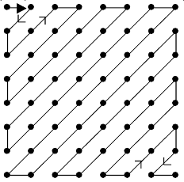

# 跟我寫 JPEG 解碼器（五）解碼

## 本章目標

在前面的章節，我們已經將 JPEG 圖檔的所有數據讀取出來了。接下來，只要再進行一些簡單的轉換，就能夠還原出原始圖像數據。

這些轉換依序爲

- 反量化
- 反 zigzag （因爲不產生數據，所以沒有在第一章列出來）
- 反向 DCT 變換
- 升採樣
- YCbCr 轉 RGB

其中的反量化、反 zigzag 、反向 DCT 變換都是對一個 block 執行，升採樣跟 YCbCr 將多個 block 合併回 MCU。

## 反量化

從 [DQT 區段](https://github.com/MROS/jpeg_tutorial/blob/master/doc/%E8%B7%9F%E6%88%91%E5%AF%ABjpeg%E8%A7%A3%E7%A2%BC%E5%99%A8%EF%BC%88%E4%B8%89%EF%BC%89%E8%AE%80%E5%8F%96%E9%87%8F%E5%8C%96%E8%A1%A8%E3%80%81%E9%9C%8D%E5%A4%AB%E6%9B%BC%E8%A1%A8.md#%E8%AE%80%E5%8F%96%E9%87%8F%E5%8C%96%E8%A1%A8dht)中，讀出了量化表，在 [SOF0 區段](https://github.com/MROS/jpeg_tutorial/blob/master/doc/%E8%B7%9F%E6%88%91%E5%AF%ABjpeg%E8%A7%A3%E7%A2%BC%E5%99%A8%EF%BC%88%E5%9B%9B%EF%BC%89%E8%AE%80%E5%8F%96%E5%A3%93%E7%B8%AE%E5%9C%96%E5%83%8F%E6%95%B8%E6%93%9A.md#%E8%AE%80%E5%8F%96-sof0-%E5%8D%80%E6%AE%B5)，知道了各個顏色分量所對應的量化表 id 。

一個 block 跟一個量化表都是 8 * 8，將它們對應的位置相乘，就完成這個轉換了。虛擬碼如下：

```
let result[8][8];
for i in 0..8 {
    for j in 0..8 {
        result[i][j] = block[i][j] * quant_table[i][j];
    }
}
```

## 反 zigzag

zigzag 時，會將一個 block 以下圖（截自標準書）的順序重新排列：



反 zigzag 就是把這個過程還原回來。

虛擬碼：
```
let ZZ = [
    [ 0,  1,  5,  6, 14, 15, 27, 28 ],
    [ 2,  4,  7, 13, 16, 26, 29, 42 ],
    [ 3,  8, 12, 17, 25, 30, 41, 43 ],
    [ 9, 11, 18, 24, 31, 40, 44, 53 ],
    [ 10, 19, 23, 32, 39, 45, 52, 54 ],
    [ 20, 22, 33, 38, 46, 51, 55, 60 ],
    [ 21, 34, 37, 47, 50, 56, 59, 61 ],
    [ 35, 36, 48, 49, 57, 58, 62, 63 ]
];
let result[8][8];
for i in 0..8 {
    for j in 0..8 {
        let order = ZZ[i][j];
        result[i][j] = block[order / 8][order % 8];
    }
}
```

## 反向 DCT 變換

$
result[i][j] = \sum{_{x=0} ^7}\sum{_{y=0} ^7}C_x C_y cos(\frac{(2i + 1)x\pi}{16}) cos (\frac{(2j + 1)y\pi}{16}) block[x][y]
$

其中的 $C_i$ 定義如下

$
C_0 = \frac{1}{\sqrt{2}} \newline
C_i = 1, \forall i > 0
$

## 升採樣

參考 [mcu 與各分量如何對應](https://github.com/MROS/jpeg_tutorial/blob/master/doc/%E8%B7%9F%E6%88%91%E5%AF%ABjpeg%E8%A7%A3%E7%A2%BC%E5%99%A8%EF%BC%88%E5%9B%9B%EF%BC%89%E8%AE%80%E5%8F%96%E5%A3%93%E7%B8%AE%E5%9C%96%E5%83%8F%E6%95%B8%E6%93%9A.md#mcu-%E8%88%87%E5%90%84%E5%88%86%E9%87%8F%E5%A6%82%E4%BD%95%E5%B0%8D%E6%87%89)一節，就可以得到 MCU 的任一個像素所對應的 Y, Cb, Cr 分量。

## YCbCr 轉 RGB

照公式變換而已，直接看虛擬碼：
```
# chomp 會將大於 255 的值變爲 255 、小於 0 的值變爲 0

let R = chomp(Y + 1.402*Cr + 128.0);
let G = chomp(Y - 0.34414*Cb - 0.71414*Cr + 128.0);
let B = chomp(Y + 1.772*Cb + 128.0);
```

## 範例程式碼
解碼過程都放在 [decoder.rs](https://github.com/MROS/jpeg_tutorial/blob/master/src/decoder.rs) 裡。

此外，jpeg_tutorial 的 [mcu 子命令](https://github.com/MROS/jpeg_tutorial/#%E6%89%93%E5%8D%B0%E6%8C%87%E5%AE%9A-mcu-%E5%9C%A8%E8%A7%A3%E7%A2%BC%E9%81%8E%E7%A8%8B%E7%9A%84%E5%90%84%E9%9A%8E%E6%AE%B5%E7%8B%80%E6%85%8B)可以打印出特定 MCU 解碼過程的各個階段，你可以善用它來除錯。

## 總結

至此已經解出任一個 MCU 的 RGB 值了，將它們組合起來就能得到原圖啦！

你可以嘗試用顯示圖形的函式庫把結果顯示出來，或是輸出到格式簡單的圖檔後再用看圖軟體打開，就可以直到自己的解碼是否正確了。我推薦 [ppm 格式](https://zh.wikipedia.org/wiki/PBM%E6%A0%BC%E5%BC%8F)，它真的超級簡單。