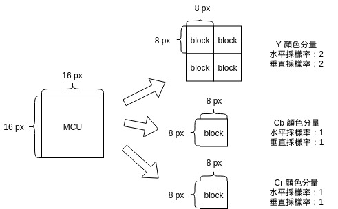
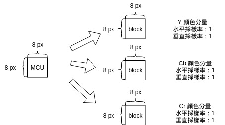
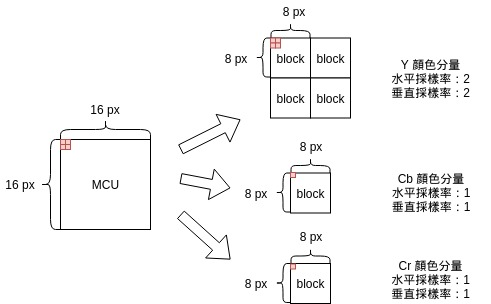

# 跟我寫 JPEG 解碼器（四）讀取壓縮圖像數據

## 本章目標

本章將會讀取 SOF0 跟 SOS。

SOF0 會提供讀取 SOS 的必要資訊， SOS 所儲存的是整個 JPEG 檔案的主體，被變換、壓縮過後的圖像數據。

| 區段 | 進度 |
|------|------|
| DQT  | ✅    |
| DHT  | ✅    |
| SOF0 | ✅    |
| SOS  | ✅    |

## JPEG 分塊機制

我們在第一章簡介 JPEG 的各種算法時，有提到 sequential 算法會由上往下解碼，這個特性可以讓在網路速度不夠的時候，即使整個 JPEG 的檔案還沒傳輸完成，就先行解碼並給網頁讀者已經接受到的部分圖片。

從這個特性中，我們察覺到， JPEG 圖檔必然是分塊進行壓縮的，因爲它不需要找到後半的數據，就已經可以解碼。

下方是圖示：


一張圖片在壓縮時會被切割成多塊 MCU ， MCU 是 Minimum Coded Unit 的縮寫，意思是最小編碼單元。

但注意，**MCU 的寬、高並不固定爲 16 px**，甚至未必是正方形，而是取決於**顏色分量的採樣率**。

### MCU 的組成

在[附錄一](https://github.com/MROS/jpeg_tutorial/blob/master/doc/%E8%B7%9F%E6%88%91%E5%AF%ABjpeg%E8%A7%A3%E7%A2%BC%E5%99%A8%EF%BC%88%E9%99%84%E9%8C%84%E4%B8%80%EF%BC%89%E7%90%86%E8%AB%96%E5%9F%BA%E7%A4%8E.md)中提到 JPEG 圖檔儲存的是 YCbCr 色彩空間，我們稱 Y, Cb, Cr 三個部分爲顏色分量，這三個顏色分量的採樣率並不相同，人眼對亮度敏感，對色度不敏感，因此通常不會去降採樣代表亮度的 Y ，而僅僅降採樣 Cb, Cr 。

#### MCU 的寬、高

我們用下面這幾張圖來解釋何謂採樣率、以及它如何影響 MCU 的組成。



這張圖片的 Y 顏色分量的水平、垂直採樣率爲 2 ， Cb, Cr 顏色分量的水平、垂直採樣率爲 1 。

每個顏色分量的**最基本單元是 block ，一個 block 的寬、高固定爲 8 * 8**。

MCU 的寬 = 8 * 最高水平採樣率

MCU 的高 = 8 * 最高垂直採樣率

用虛擬碼表示：

```
# horizontal sampling（水平採樣率） 縮寫爲 hs
# vertical sampling（垂直採樣率） 縮寫爲 vs
MCU.width  = 8 * max(Y.hs, Cb.hs, Cr.hs)
MCU.height = 8 * max(Y.vs, Cb.vs, Cr.vs)
```

因此上圖的 MCU 的寬、高皆爲 8 * max(2, 1, 1) = 16 。

注意到，這這個例子中，我們僅僅用 6 個 block 就描述了 16 * 16 px 的 MCU ，假如我們不降採樣，需要用 12 個 block 才能描述，也就是說我們透過降採樣壓縮了一半的數據量。

如果把 Y 的 水平、垂直採樣率改爲 1 ，MCU 的寬、高爲 8 * max(1, 1, 1) = 8 。圖示如下：



### MCU 與各分量如何對應？

雖然我們在本章還不用知道這個問題的答案，但是看到每個分量的大小不同，很自然就會產生這個疑問吧？

所有採樣率都爲 1 的時候，MCU 跟各個顏色分量都是 8 * 8 的正方形，直接一一對應即可。

但是在第一張圖中的例子，MCU 有 16 * 16 ，Cb, Cr 都只有 8 * 8 ，那要如何對應呢？

按照採樣率來對應，例如下圖， Cb, Cr 的最左上角對應到了 MCU 的左上四個 px ：



用虛擬碼表示會更清晰：

```
# 欲計算 MCU[i][j].Cb ，也就是 MCU 的第 i, j 個像素的 Cb 分量數值。

# Cb 儲存 Cb 顏色分量的數值
# horizontal sampling（水平採樣率） 縮寫爲 hs
# vertical sampling（垂直採樣率） 縮寫爲 vs
max_hs  = max(Y.hs, Cb.hs, Cr.hs)
max_vs = max(Y.vs, Cb.vs, Cr.vs)

# 計算 i, j 縮小到 Cb 的大小時，應該索引爲多少
# 注意此處的除號 "/" 都會捨去到整數
new_i = i * Cb.hs / max_hs
new_j = j * Cb.vs / max_vs

# Cb 是一個四階陣列
# 前兩階描述 block 的位置，後兩階描述要擷取的是這 8*8 中的哪一個點
MCU[i][j].Cb = Cb[new_i / 8][new_j / 8][new_i % 8][new_j % 8]

# Y, Cr 顏色分量與 Cb 顏色分量的對應方式完全相同，省略
```

## 讀取 SOF0 區段

SOF0 區段記錄了圖片寬、高，以及各個顏色分量的資訊，有了這些數據，我們才能夠開始讀取本章的重頭戲—— SOS 段中的壓縮圖像數據，SOF0 段詳見下表：

| 代號 | 大小    | 描述                   | 備註                                                                   |
|------|---------|------------------------|------------------------------------------------------------------------|
| ①    | 1 byte  | 精度                   | baseline 流程的精度固定爲 8 ，也就是說用 1 byte 來存取色彩空間的數值即可 |
| ②    | 2 bytes | 圖片高度               |                                                                        |
| ③    | 2 bytes | 圖片寬度               |                                                                        |
| ④    | 1 byte  | 有幾個顏色分量         | JFIF 規定顏色空間爲 YCbCr 因此顏色分量數量固定爲 3                     |
| ⑤    | 9 bytes | 各個顏色分量的詳細資訊 | 見下一張表                                                             |

上表中的 ⑤ ，爲下表重複 3 次，分別描述 3 個顏色分量的資訊：

| 代號 | 大小   | 描述        | 備註                                                                                                                                                                                                                                                                                                                                                                 |
|------|--------|-------------|----------------------------------------------------------------------------------------------------------------------------------------------------------------------------------------------------------------------------------------------------------------------------------------------------------------------------------------------------------------------|
| ①    | 1 byte | 顏色分量 id | 1 表示 Y ， 2 表示 Cb ， 3 表示 Cr                                                                                                                                                                                                                                                                                                                                         |
| ②    | 1 byte | 採樣率      | 高 4 bit 代表水平採樣率 ，低 4 bit 代表垂直採樣率。採樣率可以是 1, 2, 3, 4                                                                                                                                                                                                                                                                                                                      |
| ③    | 1 byte | 量化表 id   | 最後解碼時，要選擇哪一個量化表對該顏色分量進行量化（量化表在[第二章](./跟我寫jpeg解碼器（三）讀取量化表、霍夫曼表.md)介紹過） |

上述採樣率的限制告訴我們，一個 MCU 的寬跟高最多爲 8 * 4 = 32 。

## 讀取 SOS 區段（壓縮圖像數據）

